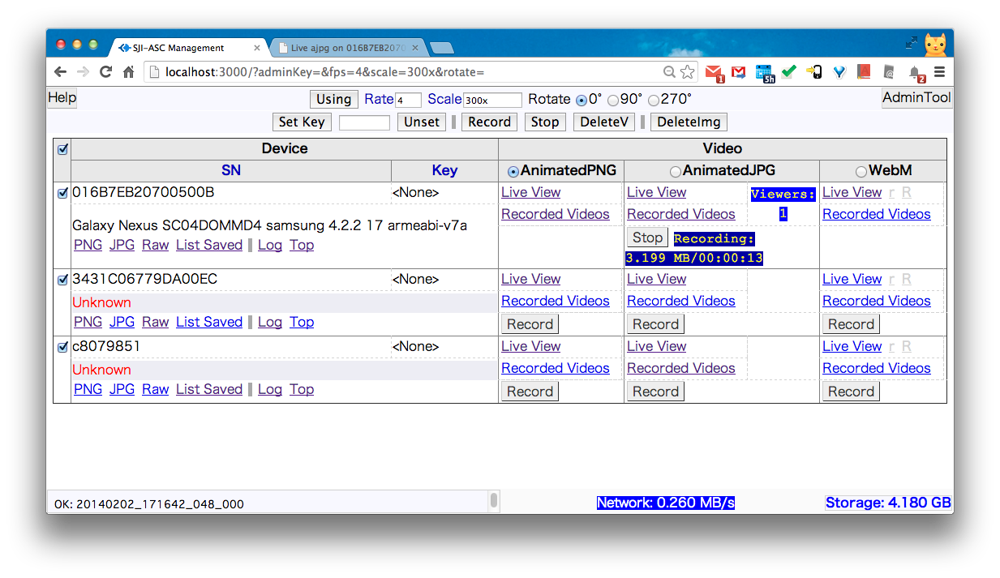
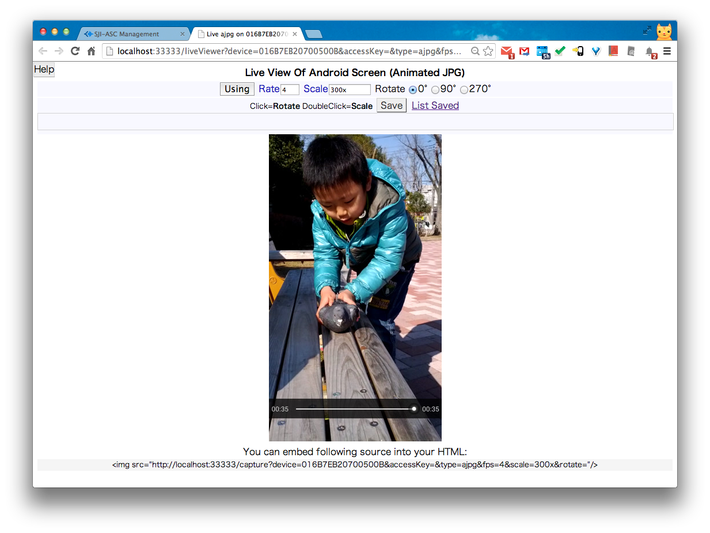
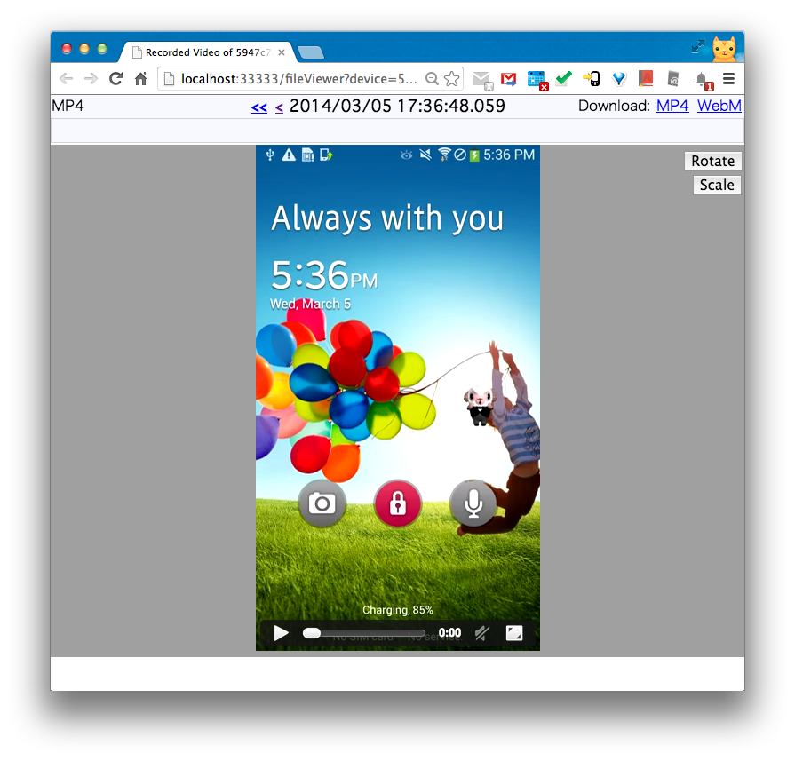

Android Fast Screen Capture & Recorder & Remote Controller From PC's Browser
===================
This project is aimed to provide a fast way to capture android screen and view,record,remote control it in PC just by HTML5 video capable browser. 
<b>No Root Required: You need NOT root your android device)</b> 
It's real time (can encode 4+ frames/second for 1920x1080 screen. If shrink size to 320xauto image, can encode at 8+ frames/second).
And it's low bandwidth usage (typically 150,000 bytes/second).
This product will do encoding in host and android by <a href="http://ffmpeg.org/">ffmpeg</a>.
Support Chrome, Firefox, Safari. Windows/Linux/Unix
<pre><code><a href="http://youtu.be/CWcOjzAJ6Sg">recorded video sample( converted by youtube)</a>  
<a href="http://youtu.be/1wZYHHzMwQ8">Usage video</a></code></pre>

<b>New</b>: Recorded file can be auto converted to <b>H.264/MP4</b> and <b>WebM</b> video format if you'v installed ffmpeg in local PC. Recommend use ffmpeg-2.0.1 
<b>New</b>: Support Remote Control by mouse click/move/drag on live view UI. (Tested on Android 4+ and 2.3) 

[Screenshot]

Menu 
 
Live View 
 
Recorded Videos 
 

[How to use]  
  
1.<b>Setup PC Environment (Windows/Mac/Linux/Unix)</b>  
<pre><code><a href="http://developer.android.com/sdk/index.html">Install Android SDK</a> (at least "Platform Tools" which include adb(Android Debug Bridge)).  
<a href="http://nodejs.org/download/">install node.js</a>.  
Install android USB driver automatically or manually when you first plug Android into PC.
If you want to always record as H.264/MP4 or WebM video format, you need <a href="http://www.ffmpeg.org/download.html">install FFMPEG into PC</a>.
</code></pre>
To simplify other settings, you'd better put the directory of adb and local ffmpeg into PATH environment variable otherwise you need put the fullpath of them into "adb" and "ffmpeg" settings in stream.json file.
  
2.<b>Start Android Screen Capture (include a video stream server) on PC</b>
<pre><code>
node dir_of_this_project/bin/stream.js
</code></pre>
You can edit configuration file <a href="https://raw.github.com/sjitech/sji-android-screen-capture/master/bin/stream.json">stream.json</a> to change IP, port, SSL...
  
Or you can specify your own configuration file which can be copied from config.json file in this dir.
<pre><code>
node dir_of_this_project/bin/stream.js dir_of_your_config/myConfig.json
</code></pre>
3.<b>Show video/animated image of android from PC by browsing <a href="http://localhost:3000/">http://localhost:3000/</a></b>   
Support <a href="http://www.webmproject.org/">WebM</a> video and <a href="http://en.wikipedia.org/wiki/H.264/MPEG-4_AVC">H.264/MP4</a> and Animated JPEG/PNG by <a href="http://en.wikipedia.org/wiki/MIME#Mixed-Replace">Multi-Part HTTP Response</a>.
Chrome,Firefox,Safari are well supported. IE10+ is not tested but should be OK.
  

===================
[Note]  
    Currently tested in android 4.2, 4.1, 4.0, 2.2, 2.3.  With PC Browser Chrome 33, Firefox 27, Safari 7.
    Host OS can be Windows/Mac/Linux (Unix should also be OK, but not tested).  
    Build: src/build_all.sh has been tested in Mac OS X 10.7 64bit and Ubuntu 12 64bit,
    Android NDK r8 or r9. Gcc 4.4.3 or 4.8.  
    bin/android/busybox is downloaded from <a href="http://www.busybox.net/downloads/binaries/latest/busybox-armv5l">busybox binary downloads</a>.