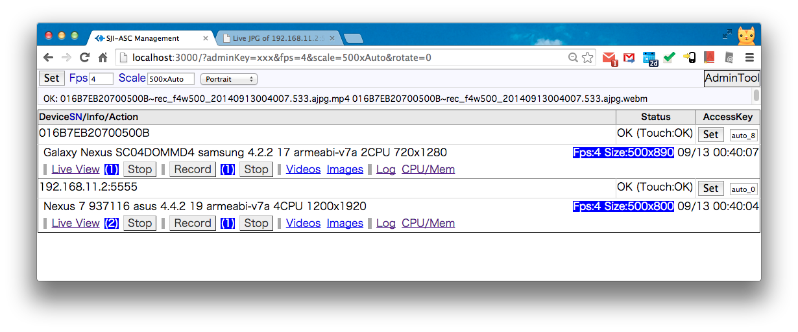
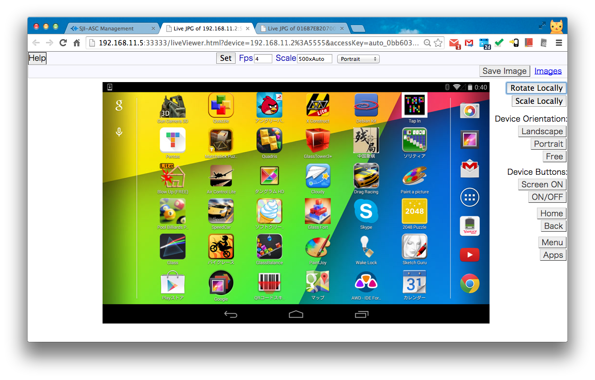
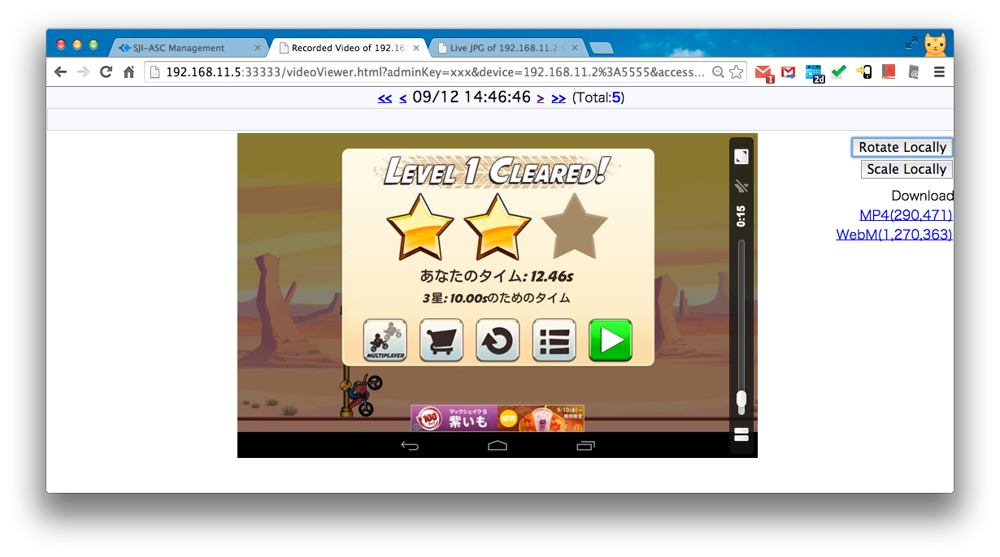

sji-android-screen-capture
==========================

<b>This project is stopped a year ago.
I suggest you use another better project <a>https://github.com/openstf/stf</a>
</b>

[Screenshot]

Home 
 
Live Viewer 
 
Recorded Video Viewer 
 

[How to use]

1.<b>Setup PC Environment (Windows/Mac/Linux/Unix)</b>
<pre><code><a href="http://developer.android.com/sdk/index.html">Install Android SDK</a> (at least "Platform Tools" which include adb(Android Debug Bridge)).
<a href="http://nodejs.org/download/">install node.js</a>.
Install android USB driver automatically or manually when you first plug Android into PC.
If you want to always record as H.264/MP4 or WebM video format, you need <a href="http://www.ffmpeg.org/download.html">install FFMPEG into PC</a>.
</code></pre>
To simplify other settings, you'd better put the directory of adb and local ffmpeg into PATH environment variable otherwise you need put the fullpath of them into "adb" and "ffmpeg" settings in config.json file.
  
2.<b>Start Android Screen Capture (include a video stream server) on PC</b>
<pre><code>
node dir_of_this_project/bin/asc.js
</code></pre>
You can edit configuration file <a href="bin/config.json">config.json</a> to change IP, port, SSL...
  
Or you can specify your own configuration file which can be partially copied from config.json file in this dir.
<pre><code>
node dir_of_this_project/bin/asc.js dir_of_your_config/myConfig.json
</code></pre>
3.<b>Show video/animated image of android from PC by browsing <a href="http://localhost:3000/">http://localhost:3000/</a></b>   
Support <a href="http://en.wikipedia.org/wiki/H.264/MPEG-4_AVC">H.264/MP4</a> and Animated JPEG/PNG by <a href="http://en.wikipedia.org/wiki/MIME#Mixed-Replace">Multi-Part HTTP Response</a>.
Chrome,Firefox,Safari are well supported.
   

===================
[Note]
    Currently tested in android 2.2~4.4.  With PC Browser Chrome 33, Firefox 27, Safari 7, IE8+.
    Host OS can be Windows/Mac/Linux (Unix should also be OK, but not tested).
    Build: src/build_all.sh has been tested in Mac OS X 10.7 64bit and Ubuntu 12 64bit,
    Android NDK r8 or r9. Gcc 4.4.3 or 4.8.
    bin/android/busybox is downloaded from <a href="http://www.busybox.net/downloads/binaries/latest/busybox-armv5l">busybox binary downloads</a>.
     
    Currently this product need PC, but can be modified to run in rooted android device directly, if you are interested please contact me.

===================
More Note:

Actually speaking, for android 4.2+, we did can get screenshot from device at high speed(30~60fps), but encoding jpeg in android and transfer in internet will cost time, so overall speed is down depends on final image size you specified and device spec. In our experience, 0.1s delay for 720x1080, about15fps, in LAN, or normal internet.

If you plan to use this product in slow internet environment, you maybe be disappointed. But you can customize this product, such as use OMX encoder in android, send H264 stream to PC's VLC  player instead of browser, that has been approved be fast.

Performance:
<a href="https://www.youtube.com/watch?v=vSFaFC_asqo&list=PLlyaJQbzuC5qUpsdetOwZtFuXEdDY4417&index=2">Youtube Video</a> 

