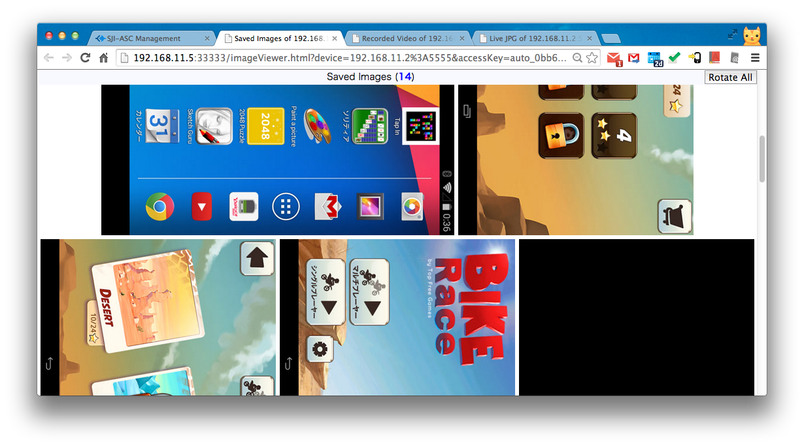
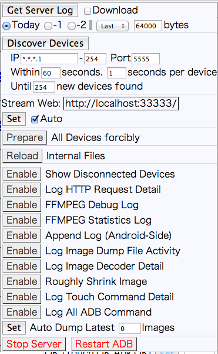

sji-android-screen-capture
==========================

<b>No kidding!</b> 
New: Ultra speed(30-60fps) screen capture for android 4.2~4.4, ADB protocol needed.  So far tested on 15 kinds of device, thereotically works on any device because i use a special way to detect system difference and adopt it, this is not easy, because even in same version, there are still different constant used by manufacture.  Even work for DRM-protected youtube player.   We have not yet used hardware assisted video encoder so still can not transmit fullscreen size in 30fps, but smaller is faster(Acording to size, you can check youtube link below).    But sorry...this project have been kept private. We will open the source later, i am not sure when.     
<b>Only if your company really really</b> want to <b>buy</b> this now then concat osexp2003@gmail.com  (Feel free to write in  English/日本語/中国語!)  

<b>New: I can provide an online demo site for you to operate my android device remotely temporarily</b>  
==========================

No-Root-Needed Android Fast Screen Capture & Caster & Recorder & Remote Controller From PC's Browser
This project is aimed to provide a fast way to capture android screen and view,record,remote control it from PC's HTML5 browser.
No Root Required: You need NOT root your android device)
It's real time (can encode 4+ frames/second for 1920x1080 screen. If shrink size to 320xauto image, can encode at 8+ frames/second). And it's low bandwidth usage (typically 150,000 bytes/second). This product will do encoding in host and android by ffmpeg. Support Chrome, Firefox, Safari, IE. Windows/Mac/Linux/Unix

   
<b>Note:We only capture screen when screen changed.</b> 
<b>Note:Although we can capture screen in 30-60fps, we currently can not yet transimit fullscreen at same speed.  We will working on it. I think this is possible if use native MediaEncoder API</b>
   

New: Recorded file can be auto converted to H.264/MP4 and WebM video format if you'v installed ffmpeg in local PC. 
New: Support Remote Control by mouse click/move/drag on live view UI. (Tested on Android 2.2~4.4) 

 
New 2014/09/15: Support IE, mobile chrome/firefox.... theoretically all browsers 
New 2014/09/15: Got screen capture 30frames/second in android 4.4 and 4.2(but 4.2 have scratch, on working) 
<b>New 2014/10/27: Successfully capture 30 screen per second in android 4.2-4.4, any size, clearly and almost 0% CPU usage!, but ffmpeg in android is too slow. I will try to optimize it or use native Media Encoder which is hardware assisted.</b> 
<b>New 2014/10/27: *****Found possibility to capture 30 screen per second in android 4.0-4.1*****</b> 
<b>New 2014/11/07: We have a plan to capture audio</b> 
 
==========================
==========================
Performance:
<a href="https://www.youtube.com/watch?v=vSFaFC_asqo&list=PLlyaJQbzuC5qUpsdetOwZtFuXEdDY4417&index=2">Youtube Video</a> 
==========================
==========================

[Screenshot]

Home 
 
Live Viewer 
 
Recorded Video Viewer 
 
Saved Image Viewer 
 
AdminTool 
 

[How to use]

1.<b>Setup PC Environment (Windows/Mac/Linux/Unix)</b>
<pre><code><a href="http://developer.android.com/sdk/index.html">Install Android SDK</a> (at least "Platform Tools" which include adb(Android Debug Bridge)).
<a href="http://nodejs.org/download/">install node.js</a>.
Install android USB driver automatically or manually when you first plug Android into PC.
If you want to always record as H.264/MP4 or WebM video format, you need <a href="http://www.ffmpeg.org/download.html">install FFMPEG into PC</a>.
</code></pre>
To simplify other settings, you'd better put the directory of adb and local ffmpeg into PATH environment variable otherwise you need put the fullpath of them into "adb" and "ffmpeg" settings in config.json file.
  
2.<b>Start Android Screen Capture (include a video stream server) on PC</b>
<pre><code>
node dir_of_this_project/bin/asc.js
</code></pre>
You can edit configuration file <a href="bin/config.json">config.json</a> to change IP, port, SSL...
  
Or you can specify your own configuration file which can be partially copied from config.json file in this dir.
<pre><code>
node dir_of_this_project/bin/asc.js dir_of_your_config/myConfig.json
</code></pre>
3.<b>Show video/animated image of android from PC by browsing <a href="http://localhost:3000/">http://localhost:3000/</a></b>   
Support <a href="http://www.webmproject.org/">WebM</a> video and <a href="http://en.wikipedia.org/wiki/H.264/MPEG-4_AVC">H.264/MP4</a> and Animated JPEG/PNG by <a href="http://en.wikipedia.org/wiki/MIME#Mixed-Replace">Multi-Part HTTP Response</a>.
Chrome,Firefox,Safari are well supported.
   

===================
[Note]
    Currently tested in android 2.2~4.4.  With PC Browser Chrome 33, Firefox 27, Safari 7, IE8+.
    Host OS can be Windows/Mac/Linux (Unix should also be OK, but not tested).
    Build: src/build_all.sh has been tested in Mac OS X 10.7 64bit and Ubuntu 12 64bit,
    Android NDK r8 or r9. Gcc 4.4.3 or 4.8.
    bin/android/busybox is downloaded from <a href="http://www.busybox.net/downloads/binaries/latest/busybox-armv5l">busybox binary downloads</a>.
     
    Currently this product need PC, but can be modified to run in rooted android device directly, if you are interested please contact me.
