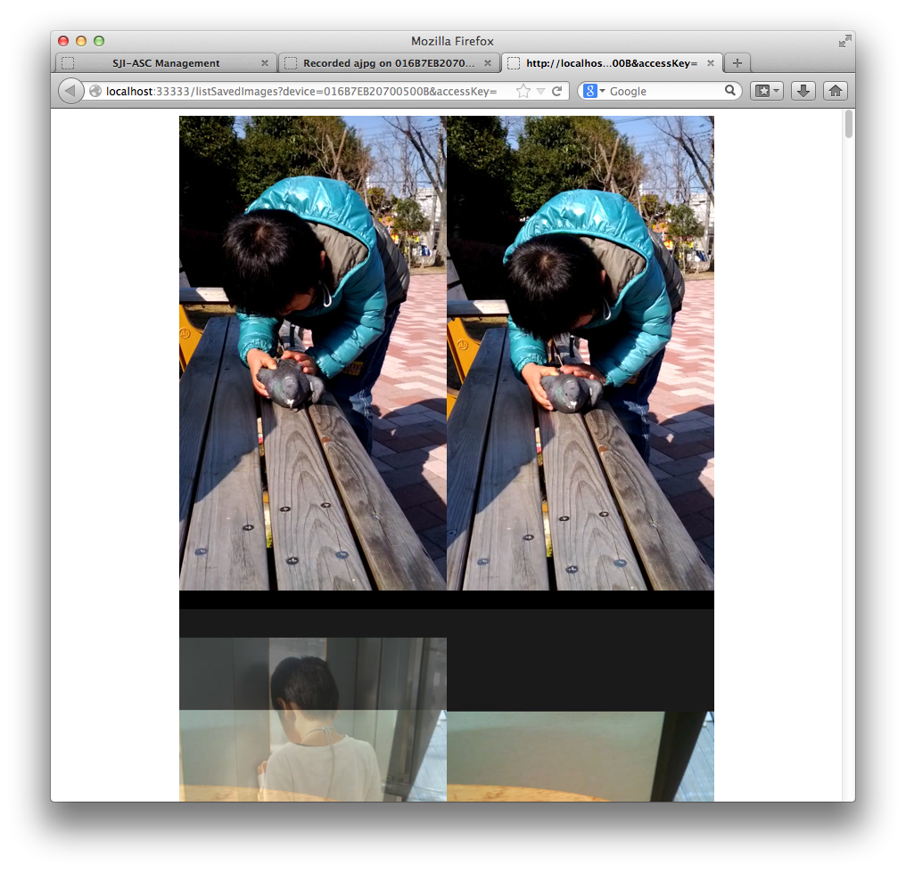

sji-android-screen-capture
===================
<b>Android Screen Capture (For HTML5 Video Live Streaming)</b>  
This project is aimed to capture android screen and view it in HTML5 video capable browser.  
Yes, real time, low bandwidth.  This product will do encoding in android by <a href="http://ffmpeg.org/">ffmpeg</a>.  
<pre><code><a href="http://youtu.be/CWcOjzAJ6Sg">recorded video sample( converted by youtube)</a>  
<a href="http://youtu.be/1wZYHHzMwQ8">Usage video</a></code></pre>
  
[Screenshot]

Menu 
 
Live View 
 
Recorded Videos 
 
Grabbed Images: 
 

[How to use]  
  
1.<b>Setup PC Environment (Windows/Mac/Linux/Unix)</b>  
<pre><code><a href="http://developer.android.com/sdk/index.html">Install Android SDK</a> (at least "Platform Tools" which include adb(Android Debug Bridge)).  
<a href="http://nodejs.org/download/">install node.js</a>.  
Install android USB driver automatically or manually when you first plug Android into PC.  
</code></pre>

3.<b>Start Android Screen Capture (include a video stream server) on PC</b>  
<pre><code>cd path_of_this_project/bin  
node stream.js
</code></pre>
You can edit configuration file <a href="https://raw.github.com/sjitech/sji-android-screen-capture/master/bin/stream.json">stream.json</a> to change IP, port, SSL...  
  
4.<b>Show video/image of android from PC by browsing <a href="http://localhost:3000/">http://localhost:3000/</a></b>   
For video, currently only support <a href="http://www.webmproject.org/">WebM</a> video, so recommend <a href="http://www.google.com/chrome">Google Chrome Browser</a>.  
For image, currently support animated PNG by <a href="http://en.wikipedia.org/wiki/MIME#Mixed-Replace">multi-part http response</a>. Chrome and Firefox are well supported.  
  
To embed Animated PNG image into your html page:  
<pre><code>&lt;img src="http://localhost:33333/capture?device=yourDeviceSerialNumber&type=apng&fps=4" /&gt;
</code></pre>

To embed webm video into your html page:  
<pre><code>&lt;video controls preload="none" autobuffer="false"&gt;  
  &lt;source src="http://localhost:33333/capture?device=yourDeviceSerialNumber&type=webm&fps=4" type="video/webm">  
&lt;/video&gt;
</code></pre>  

To just capture one screenshot:  
<pre><code>&lt;img src="http://localhost:33333/capture?device=yourDeviceSerialNumber&type=png" /&gt;
</code></pre>

[Note]:  
All above URLs can specify scale and rotate optionally by append following querystring:
<pre>
&scale=0.5&rotate=270 or  
&scale=300x or  
&scale=300x200 or  
&scale=x200 ...  
</pre>  
  
For advanced usage, please start menu page, move mouse to link and button to see URL.  
 
 
You can attach an access key for device so all above URL must  appended &accessKey=yourAccessKey otherwise you get "access denied" error response.  
Typically stream web server administrator set adminKey e.g. xxxx,   
then submit URL request:  
<pre>  
http://localhost:3000/deviceControl?adminKey=xxxx&action=setAccessKey&accessKey=yyyy&device=sn1&device=sn2  ....  
</pre>  
This will attach access key yyyy to device sn1 and sn2.  
  
To start record Animated PNG image, you can submit following URL request:  
<pre>  
http://localhost:3000/deviceControl?adminKey=xxxx&action=startRecording&device=sn1&device=sn2&type=apng&fps=4  
</pre>  
  
This will start record on device sn1 and sn2. The fps means rate. You can optionally specify scale and rotate querystring.  
  
To stop record Animated PNG image, embed following URL into your HTML img tag:  
<pre>  
http://localhost:3000/deviceControl?adminKey=xxxx&action=stopRecording&device=sn1&device=sn2    
</pre>  
  
To play record file Animated PNG image, embed following URL into your HTML img tag:  
<pre>  
http://localhost:33333/playRecordedFile?&device=sn1&accessKey=yyyy&type=apng  
</pre>  
  
You can optionally specify custom playback rate by fps querystring.  

To download record file Animated PNG image, embed following URL into your HTML page:  
<pre>  
http://localhost:33333/downlodRecordedFile?&device=sn1&accessKey=yyyy&type=apng  
</pre>  
  
For webm format, just change apng to webm and img tag to video tag in above steps.   

===================  
[Note]  
    Currently tested in android 4.2, 4.1, 4.0, 2.2, 2.3.  With PC Browser Chrome, Firefox.  
    Host OS can be Windows/Mac/Linux (Unix should also be OK, but not tested).  
    Build: src/build_all.sh has been tested in Mac OS X 10.7 64bit and Ubuntu 12 64bit,
    Android NDK r8 or r9. Gcc 4.4.3 or 4.8.  
    bin/android/run.sh_/busybox is download from <a href="http://www.busybox.net/downloads/binaries/latest/busybox-armv5l">busybox binary downloads</a>.  
